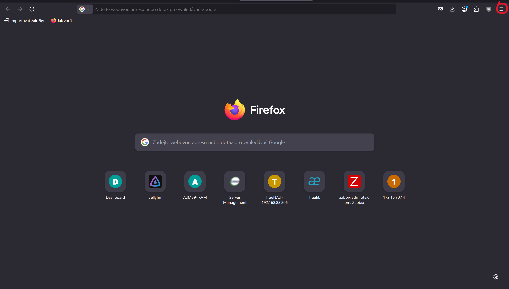
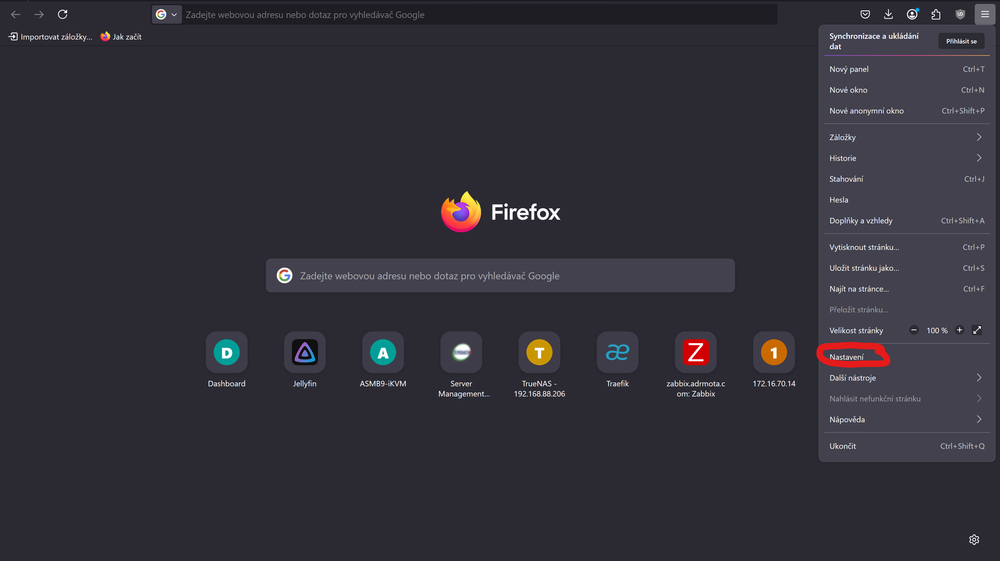
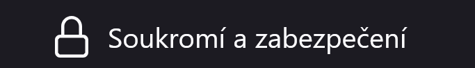
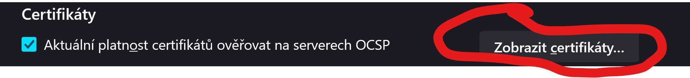
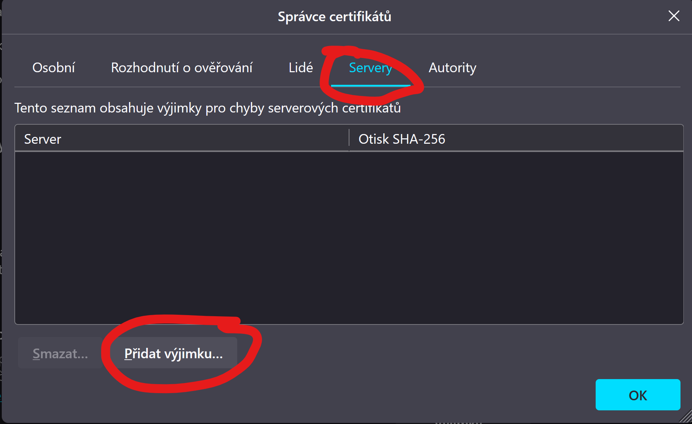
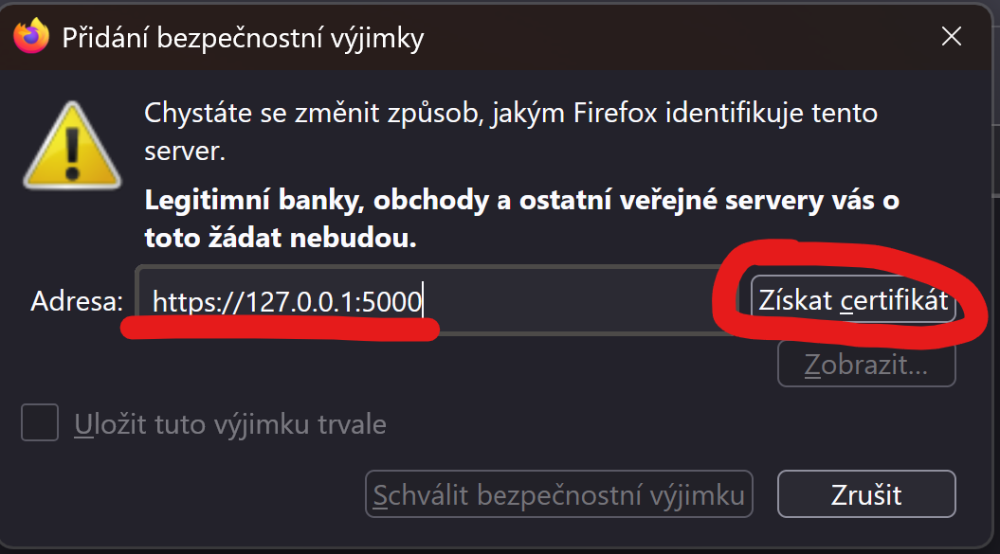
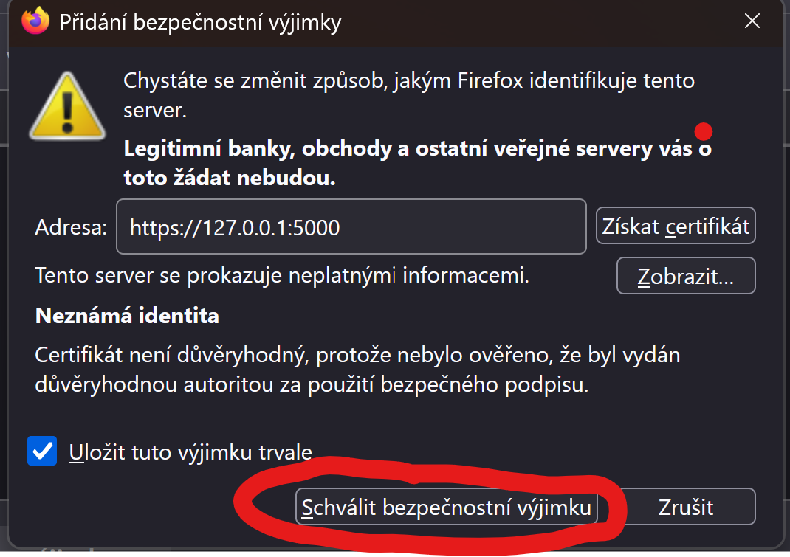

# Nastavení certifikátu jako důveryhodný

- Vzhledem k tomu, že nemám certifikát od oficiální autority jako je třeba letsencrypt a certifikát jsem si vytvořil sám, tak mu musíme přidělit vyjímku.

Certifikát přidáme mezi důveryhodné následujcím způsobem:

    1. Otevřeme firefox a klikneme v pravém horním rohu na tojpodtržítko:
   
    
    2. Následně zvolíme nastavení:
   

    3. Zde zvolíme Bezpečnost a zabezpečení:
   

    4. Zde zvolíme Zobrazit certifikáty:
   

    5. Zde se zaklikneme do záložky Servery a následně klikneme na přidat vyjímku:
   

    6. Zde zadáme adresu serveru, pro který chceme přidat bezpečnostní vyjímku (v našem případě 127.0.0.1:5000, nebo localhost:5000) a následně klikneme na Získat certifikát a necháme lišku chvíli chroustat:
   

    7. Až liška dochroustá, tak klikneme na přidat vyjímku:
   

    8. Toto je vše.

